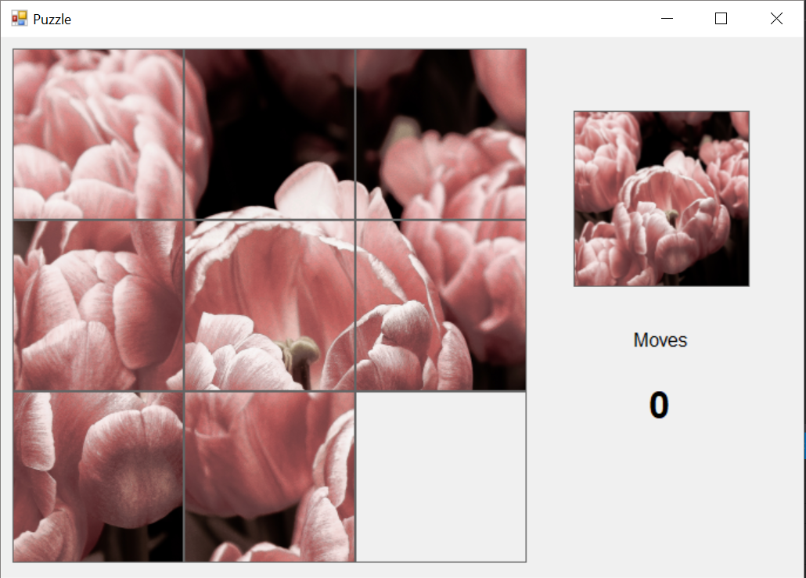
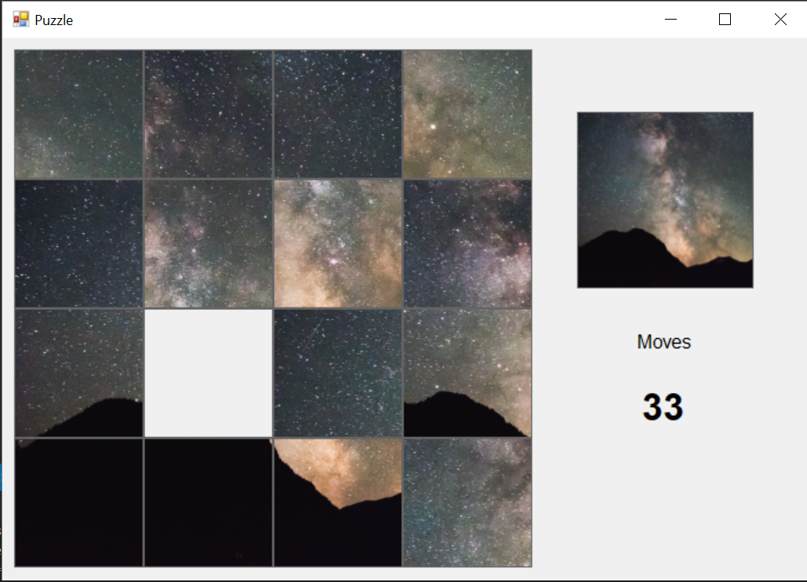

# Sliding Puzzle game

🖼️ Windows Forms App for the classic Sliding Puzzle game.

## Features
* The user can import the image he would like to play with via File Dialog
* Multiple difficulty levels: image can be split into 4, 9, 25 or 36 squares
* The app keeps track of the number of moves you make.

